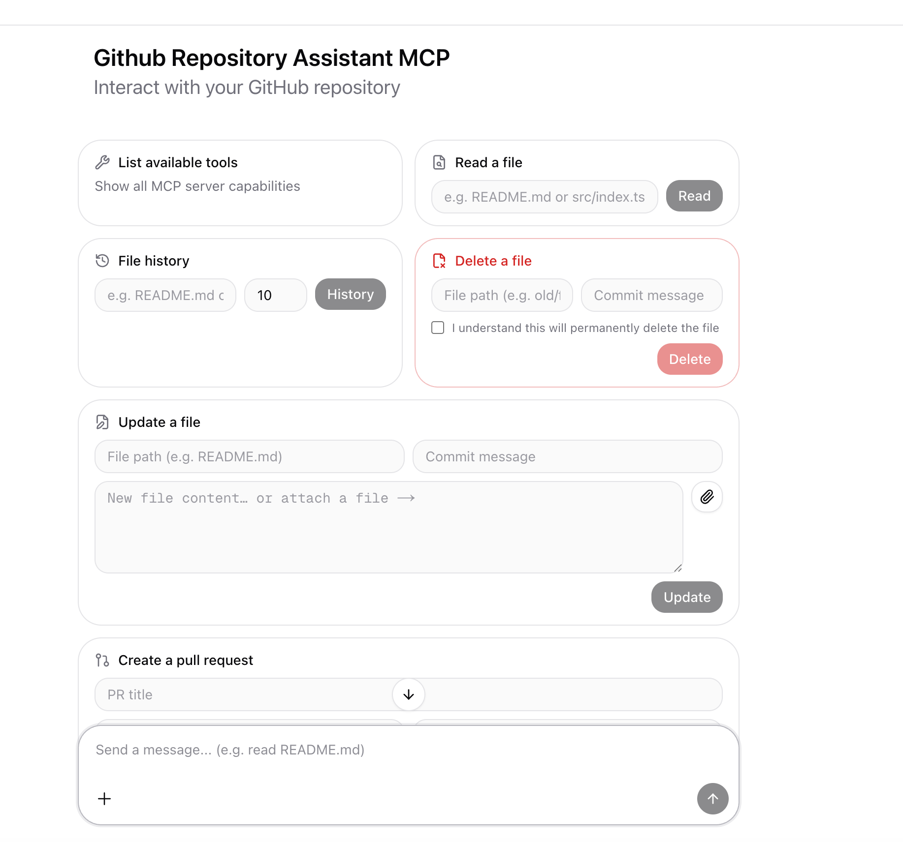

# Github Repository Assistant MCP

This repository contains a local MCP setup and a web-based chat UI for interacting with any GitHub repository through a conversational interface.

The code in this repository is public.
The target repository remains private.
Credentials are not committed here and must be provided locally through environment variables.



## What This Repository Contains

This project is split into three parts:

- `server/`: the MCP server + FastAPI backend
- `web/`: a Next.js chat UI powered by AssistantUI
- `client/`: a simple local CLI client

They work together as follows:

1. The FastAPI backend (`server/src/api_app.py`) starts the MCP server as a subprocess over `stdio` and holds a long-lived `ClientSession`.
2. The Next.js frontend sends chat messages to `/api/chat`, which proxies them to the FastAPI `/api/assistant` endpoint.
3. The backend detects the intent from the user's message and dispatches to the appropriate MCP tool.
4. The MCP server authenticates against GitHub using a local token and performs the requested action via the GitHub REST API.

## Web UI

The web interface is a Next.js application built with [AssistantUI](https://www.assistant-ui.com/). It provides a chat-style interface with pre-built quick action cards for every supported tool.

### Quick Action Cards

The welcome screen displays the following action cards:

| Card | Description |
|---|---|
| **List available tools** | One-click button that lists all MCP tool names |
| **Read a file** | Enter a file path (supports dotfiles like `.gitignore`) and click Read |
| **File history** | Enter a file path and an optional commit limit (default 10) to view commit history |
| **Update a file** | Enter a file path, commit message, and file content; or attach a local file using the 📎 button — the textarea is replaced by a filename pill when a file is attached |
| **Delete a file** | Enter a file path and commit message; requires checking a confirmation checkbox before the Delete button activates |
| **Create a pull request** | Enter a PR title, select head and base branches from live dropdowns (fetched from the repo), and optionally add a description |

### Natural Language

All actions can also be triggered by typing in the composer. Examples:

```
list tools
read README.md
history src/index.ts
history .gitignore limit: 5
update README.md commit: fix typo content: new text here
delete old/file.md commit: remove unused file
create pr title: Add feature from: feature-branch into: main
```

### Running the Web UI

```bash
cd web
npm install
npm run dev
```

The UI is available at [http://localhost:3000](http://localhost:3000).

Set `BACKEND_URL` in `web/.env` to point to your FastAPI backend (default: `http://localhost:8000`):

```env
BACKEND_URL=http://localhost:8000
```

## Server

The MCP server lives in `server/src/` and is responsible for:

- loading configuration from `.env`
- validating the configured GitHub repository URL
- authenticating with GitHub using `GITHUB_TOKEN`
- exposing MCP tools
- serving a FastAPI HTTP API that the web UI consumes

### MCP Tools

- `list_tools` — list all available MCP tools
- `read_file` — read a UTF-8 text file from the repository
- `update_file` — update or create a file with a commit message
- `delete_file` — delete a file with a commit message
- `get_file_history` — return commit history for a file
- `create_pull_request` — open a PR from a head branch to a base branch

### FastAPI Endpoints

| Method | Path | Description |
|---|---|---|
| `GET` | `/api/health` | Health check; reports MCP session status |
| `GET` | `/api/list-tools` | List MCP tool names |
| `GET` | `/api/branches` | List repository branches (used by the PR card) |
| `POST` | `/api/assistant` | Intent detection + MCP tool dispatch |

### Running the Backend

```bash
source .venv/bin/activate
uvicorn api_app:app --app-dir server/src --host 0.0.0.0 --port 8000 --reload
```

## Client

The client lives in `client/` and is a minimal command-line MCP client.

Its job is to:

- start the local MCP server
- initialize an MCP session
- list available tools
- invoke the `read_file` tool
- invoke the `update_file` tool
- invoke the `delete_file` tool
- invoke the `get_file_history` tool
- invoke the `create_pull_request` tool

This client exists so you can use the MCP server without a browser.

## Project Structure

```text
.
├─ client/
│  └─ cli.py
├─ server/
│  ├─ src/
│  │  ├─ api/
│  │  │  └─ v1/
│  │  │     └─ api.py          # FastAPI routes + intent detection
│  │  ├─ api_app.py            # FastAPI app + MCP session lifecycle
│  │  ├─ config.py
│  │  ├─ github_client.py
│  │  ├─ models.py
│  │  ├─ security.py
│  │  └─ server.py             # MCP server (FastMCP)
│  └─ .env
├─ web/
│  ├─ app/
│  │  ├─ api/
│  │  │  ├─ branches/          # Proxy → FastAPI /api/branches
│  │  │  └─ chat/              # Proxy → FastAPI /api/assistant
│  │  └─ assistant.tsx         # useLocalRuntime + MCPAdapter
│  └─ components/
│     └─ assistant-ui/
│        └─ thread.tsx         # Chat thread + all quick action cards
├─ tests/
├─ .env.example
├─ pyproject.toml
└─ README.md
```

## Configuration

Copy `.env.example` to `server/.env` and set:

```env
REPO_URL=https://github.com/your-user/your-repo.git
GITHUB_TOKEN=github_pat_your_token_here
REPO_REF=main
LOCAL_SOURCE_DIR=/absolute/path/to/local/replacement-files
```

Variable meaning:

- `REPO_URL`: the GitHub repository to target
- `GITHUB_TOKEN`: a token with access to that repository
- `REPO_REF`: optional branch or tag to read from (defaults to the repo default branch)
- `LOCAL_SOURCE_DIR`: optional local directory used when `update_file` replaces content from a local file

Token permissions required:

- classic tokens: `repo` scope
- fine-grained tokens: Contents (Read & Write), Pull Requests (Read & Write)

## Installation

Using a virtual environment is highly recommended:

```bash
python3 -m venv .venv
source .venv/bin/activate
python -m pip install --upgrade pip
python -m pip install -e .
```

## Usage

### Web UI (recommended)

```bash
# Terminal 1 — backend
source .venv/bin/activate
uvicorn api_app:app --app-dir server/src --host 0.0.0.0 --port 8000 --reload

# Terminal 2 — frontend
cd web && npm install && npm run dev
```

Open [http://localhost:3000](http://localhost:3000) and use the quick action cards or type a message.

### CLI

List tools:

```bash
python client/cli.py list-tools
```

Read a file:

```bash
python client/cli.py read-file --path README.md
```

Update a file with inline content:

```bash
python client/cli.py update-file --path README.md --message "Update README" --content "# New README"
```

Update a file from a local replacement file inside `LOCAL_SOURCE_DIR`:

```bash
python client/cli.py update-file --path README.md --message "Replace README" --source-path README.md
```

Delete a file:

```bash
python client/cli.py delete-file --path old-page.md --message "Remove old page"
```

Create a pull request:

```bash
python client/cli.py create-pr --title "Add feature" --head feature-branch --base main --body "Please merge"
```

Get file history:

```bash
python client/cli.py get-file-history --file-name .gitignore --branch main
```

Returned JSON shape (each entry):

```json
{
  "name": "Author name",
  "email": "author@example.com",
  "date": "2026-04-27T12:34:56Z",
  "message": "Commit message",
  "url": "https://github.com/owner/repo/commit/..."
}
```

### Docker

Build:

```bash
docker build -t github-repository-assistant-mcp .
```

Run:

```bash
docker run --rm \
  -e REPO_URL="https://github.com/your-user/your-repo.git" \
  -e GITHUB_TOKEN="ghp_..." \
  github-repository-assistant-mcp list-tools
```

Mount a local directory to use `LOCAL_SOURCE_DIR`:

```bash
docker run --rm \
  -e REPO_URL="https://github.com/your-user/your-repo.git" \
  -e GITHUB_TOKEN="ghp_..." \
  -e LOCAL_SOURCE_DIR="/data" \
  -v /path/on/host/local_files:/data \
  github-repository-assistant-mcp update-file --path README.md --message "Update via docker" --source-path README.md
```

## Notes on Security

- this repository does not store credentials
- `.env` is local-only and ignored by git
- GitHub access happens at runtime through `GITHUB_TOKEN`
- TLS verification uses `certifi`
- local replacement files are restricted to `LOCAL_SOURCE_DIR`

## Current Limitations

- MCP tools are focused on per-file operations and lightweight repo actions
- the server reads from and modifies the remote GitHub repository using the GitHub REST APIs (Contents API for file ops, Pulls API for PRs)
- bulk or atomic multi-file tree operations are not supported
- authentication depends on `GITHUB_TOKEN` provided at runtime

## Testing

```bash
.venv/bin/python -m unittest discover -s tests
```


The code in this repository is public.
The target repository remains private.
Credentials are not committed here and must be provided locally through environment variables.

## What This Repository Contains

This project is split into two parts:

- `src/`: the MCP server
- `client/`: a simple local CLI client

They work together as follows:

1. The client starts the MCP server as a local subprocess over `stdio`.
2. The server exposes MCP tools.
3. The server authenticates against GitHub using a local token.
4. The server performes a set of pre-configured actions (read file for example) on the private remote repository through the GitHub API.

## Server

The MCP server lives in `src/` and is responsible for:

- loading configuration from `.env`
- validating the configured GitHub repository URL
- authenticating with GitHub using `GITHUB_TOKEN`
- exposing MCP tools

Current scope:

- `read_file`
- `update_file`
- `delete_file`
- `commit_file` (single-file commit with optional author metadata)
- `get_file_history` (returns commit history for a file)
- `create_pull_request` (open a PR from a head branch to a base branch)

At the moment, the server supports reading a text file, updating or creating a file, deleting a file, committing a single file on behalf of a user, fetching a file's commit history, and creating pull requests on the private remote repository.

## Client

The client lives in `client/` and is a minimal command-line MCP client.

Its job is to:

- start the local MCP server
- initialize an MCP session
- list available tools
- invoke the `read_file` tool
- invoke the `update_file` tool
- invoke the `delete_file` tool
- invoke the `commit_file` tool (single-file commit with optional author)
- invoke the `get_file_history` tool (list of commit entries)

This client exists so you can use the MCP server without needing a separate desktop MCP host.

## Project Structure

```text
.
├─ client/
│  └─ cli.py
├─ src/
│  ├─ config.py
│  ├─ github_client.py
│  ├─ security.py
│  └─ server.py
├─ tests/
├─ .env.example
├─ pyproject.toml
└─ README.md
```

## Configuration

Copy `.env.example` to `.env` and set:

```env
REPO_URL=https://github.com/your-user/your-private-repo.git
GITHUB_TOKEN=github_pat_your_token_here
REPO_REF=main
LOCAL_SOURCE_DIR=/absolute/path/to/local/replacement-files
```

Variable meaning:

- `REPO_URL`: the private GitHub repository to target
- `GITHUB_TOKEN`: a token with access to that private repository
- `REPO_REF`: optional branch or tag to read from
- `LOCAL_SOURCE_DIR`: optional local directory used when `update_file` replaces content from a local file

For private repositories:

- classic personal access tokens typically need `repo`
- fine-grained tokens need repository access plus `Contents: Read` and `Contents: Write`

## Installation

Using a virtual environment is highly recommended:

```bash
python3 -m venv .venv
source .venv/bin/activate
python -m pip install --upgrade pip
python -m pip install -e .
```

## Usage

List tools:

```bash
python client/cli.py list-tools
```

Read a file from the private repository:

```bash
python client/cli.py read-file --path tsconfig.json
```

Docker (portable)

Build the image locally:

```bash
docker build -t github-repository-assistant-mcp .
```

Run client commands with the image. Provide required env vars (at minimum REPO_URL and GITHUB_TOKEN).

Examples:

List tools:

```bash
docker run --rm -e REPO_URL="https://github.com/your-user/your-private-repo.git" -e GITHUB_TOKEN="ghp_..." github-repository-assistant-mcp list-tools
```

Read a file:

```bash
docker run --rm -e REPO_URL="https://github.com/your-user/your-private-repo.git" -e GITHUB_TOKEN="ghp_..." github-repository-assistant-mcp read-file --path README.md
```

Commit a file from a host directory (mount host dir into container and set LOCAL_SOURCE_DIR to the mount point):

```bash
docker run --rm \
  -e REPO_URL="https://github.com/your-user/your-private-repo.git" \
  -e GITHUB_TOKEN="ghp_..." \
  -e LOCAL_SOURCE_DIR="/data" \
  -v /path/on/host/local_files:/data \
  github-repository-assistant-mcp commit-file --path README.md --message "Update via docker" --source-path README.md --author-name "Alice" --author-email "alice@example.com"
```

Notes:

- LOCAL_SOURCE_DIR must point to an absolute path inside the container. Bind-mount the host directory to that path with `-v`.
- Keep your tokens secret; prefer passing them via an environment file or Docker secrets in production.


Update a file with inline content:

```bash
python client/cli.py update-file --path README.md --message "Update README" --content "# New README"
```

Update a file from a local replacement file inside `LOCAL_SOURCE_DIR`:

```bash
python client/cli.py update-file --path README.md --message "Replace README" --source-path README.md
```

When `--source-path` is used, the replacement file can be binary, for example a `.pdf`.

Delete a file:

```bash
python client/cli.py delete-file --path old-page.md --message "Remove old page"
```

Create a pull request:

```bash
python client/cli.py create-pr --title "Add feature" --head feature-branch --base main --body "Please merge"
```

Get file history (returns a JSON array of commit entries):

```bash
python client/cli.py get-file-history --file-name .gitignore --branch main
```

Returned JSON shape (each entry):

```json
{
  "name": "Author name",
  "email": "author@example.com",
  "date": "2026-04-27T12:34:56Z",
  "message": "Commit message",
  "url": "https://github.com/owner/repo/commit/..."
}
```

You can also use the virtualenv Python directly:

```bash
.venv/bin/python client/cli.py read-file --path tsconfig.json
```

## Running the Server Directly

If you want to start the MCP server on its own:

```bash
python src/server.py
```

After installation, this also works:

```bash
github-repository-assistant-mcp-server
```

In normal usage, you do not need to start the server manually because the client starts it for you.

## Notes on Security

- this repository does not store credentials
- `.env` is local-only and ignored by git
- GitHub access happens at runtime through `GITHUB_TOKEN`
- TLS verification uses `certifi`
- local replacement files are restricted to `LOCAL_SOURCE_DIR`

## Current Limitations

- implemented MCP tools are focused on per-file operations and lightweight repo actions: `read_file`, `update_file`, `delete_file`, `get_file_history`, and `create_pull_request`.
- the server reads from and modifies the remote GitHub repository using the GitHub REST APIs (Contents API for file ops, Pulls API for PRs).
- bulk or atomic multi-file tree operations are not supported (use Git Data API or local workflows for complex changes).
- authentication depends on GITHUB_TOKEN provided at runtime; ensure token has appropriate repo permissions.

## Testing

Run the current test suite with:

```bash
.venv/bin/python -m unittest discover -s tests
```
